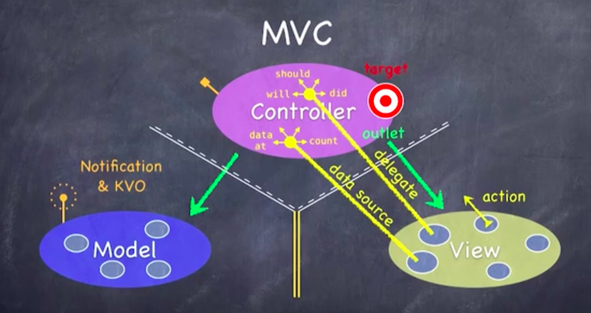

## Lecture2. MVC

1. Controller <-> View
   1. target - action
      1. controller holds a target
      2. when the action happens, the target is called.
   2. delegate : 컨트롤러가 뷰의 "위임자"로서 자신을 설정( __protocol을 통해서 설정 : should, will, did__ )
      1. controller <-> View 간 커뮤니케이션은 :
         1. __view가 controller에 대하여 blind 하여야 하고__
         2. __structured 되어야 한다.__
   3. data source( __count, data at__)
      1. 뷰라는 객체가 인스턴스 변수로서 (대용량의) 데이터를 가지고 있는 것이 아니라,
      2. controller가 data source가 되어, 필요할 때마다 데이터를 쏴주는 방식.

2. Controller <-> Model
   * Model이 자기에게 일어난 변화에 대하여 __broadcast 함.__
   * __Notification & KVO(Key Value Observing)__ 
     * Controller가 __데이터 모델에서 자신이 필요한 것들에 주파수를 맞추어 - 변화 구독 가능.__